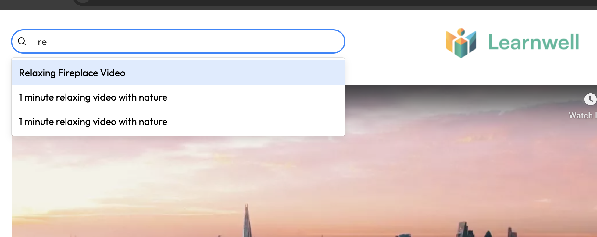

# Educational Video Player Fullstack

## Overview

Educational Video Player Fullstack is a web application that allows users to upload, view videos, and leave comments, similar to the functionality of YouTube. The project utilizes Ruby on Rails for the backend to communicate with third-party APIs and for server-side rendering (SSR). The frontend is built with React, TypeScript, RTK Query, and WindiCSS, connected through the vite-rails plugin.

## Table of Contents
- [Installation](#installation)
  - [Backend Setup (Ruby on Rails)](#backend-setup-ruby-on-rails)
  - [Frontend Setup (Vite + React)](#frontend-setup-vite--react)
- [Usage](#usage)
  - [Uploading a New Video](#uploading-a-new-video)
  - [Searching for a Video](#searching-for-a-video)
  - [Making a Comment on a Video](#making-a-comment-on-a-video)


## Installation

### Backend Setup (Ruby on Rails)

1. **Clone the repository**
    ```bash
    git clone https://github.com/aneldanza/educational-video-player-fullstack.git
    cd educational-video-player-fullstack
    ```

2. **Install Ruby and Rails**
    Ensure you have Ruby installed. You can use a version manager like `rbenv` or `rvm`. Install Rails if you haven't already:
    ```bash
    gem install rails
    ```

3. **Install backend dependencies**
    Navigate to the backend directory and install the required gems:
    ```bash
    bundle install
    ```

4. **Start the Rails server**
    ```bash
    rails server
    ```
    Your backend API should now be running on `http://localhost:3000`. You may encounter an error initially because the frontend needs to be set up as well.

### Frontend Setup (Vite + React)

1. **Install Node.js and npm**
    Ensure you have Node.js and npm installed. You can download them from [here](https://nodejs.org/).

2. **Install frontend dependencies**
    Open a new terminal tab in the project directory and run:
    ```bash
    npm install
    ```

3. **Start the React development server**
    ```bash
    npm run dev
    ```

You can now visit `http://localhost:3000` to see the app in action.

## Usage

### Uploading a New Video

To upload a new video:
1. Click on the `Upload` button in the top-right corner.
2. Add a title, description, and URL of the video.
3. Click `Upload`.


### Searching for a Video

To search for a video:
1. Click on the search bar on the top-left corner.
2. You will see a dropdown with the list of all available videos. You can choose from the list or you can start typing in the search bar to filter the videos further.
3. Select desired video and click Enter.



### Making a Comment on a Video

To comment on a video:
1. Click on any video from the list.
2. Under the opened video, find the form with the `Comment` button.
3. Add your comment in the input field.
4. Click `Comment`.


